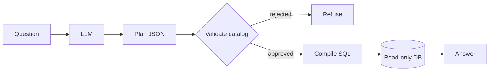

# Ask a database without letting an AI write SQL

## The problem

The usual “chat with your data” path is: dump the schema, have an LLM write SQL, run it. That works in demos and fails in production.

1. **It can be wrong and sound right.** A bad query still returns a number.
2. **It can be talked into anything.** The model’s output is a string you execute.

This project takes SQL away from the model.

## The idea

The LLM only fills a **Logical Query Plan (LQP)** — a JSON form with a fixed set of fields (source table, approved joins, filters, aggregates). It is not SQL.

Code you own checks the form against a human-approved **catalog**, then *that* code compiles SQL. The model never sees or writes a SQL string.

The LLM box is untrusted. Everything after it is testable code.

## Catalog vs database vs Unity Catalog

| | Who decides | Role |
|---|---|---|
| Database schema | The warehouse | Fact: what exists |
| **Secure Query catalog** | A human | Allowlist the planner may name |
| Databricks **Unity Catalog** | Warehouse admins | Grants, RLS, masks at execute time |

A live schema dump is the wrong allowlist (internal, deprecated, and sensitive columns). `fetch_unity_catalog_draft` / `catalog_draft` produce an **unapproved draft**. PII flags and join keys need review before `SECURE_QUERY_CATALOG_FILE`.

This demo catalog is all 11 [Chinook](https://github.com/lerocha/chinook-database) tables. `Email` is `pii_risk=high`; `Invoice.Total` is `unit=USD`.

## One question, end to end

`python -m secure_query.demo.ask --provider ollama "What are the top 3 billing countries by total revenue?"`

1. **Plan** — JSON only. One repair if validate fails, then clarify. No silent rewrite of your question.
2. **Validate** — tables, columns, approved joins, types, PII, required limit.
3. **Explain-back** — English from code (`explain_plan`), so you can confirm before Run.
4. **Compile** — sqlglot AST, quoted identifiers.
5. **Execute** — read-only, timeout, row cap. Money columns display as USD (e.g. `$523.06`) with a scale note (hundreds of dollars, not thousands or millions).
6. **Audit** — question, plan, SQL, hashes, principal in `data/audit.jsonl`.

The UI at `/` is the same loop: **Review plan** then **Run query**.

## Safer by construction

- Hostile SQL is not a field in the form. `DROP`, `UNION`, comment tricks are unrepresentable.
- High-PII columns cannot be selected, filtered, grouped, or `MIN`/`MAX`’d. List queries never `SELECT *`.
- Out-of-scope terms, dropped concepts, and unread joins refuse instead of guessing.
- Suggestions (if any) are catalog questions that themselves pass those guards.

## Measured (Chinook)

| Run | Model | Result |
|-----|--------|--------|
| Holdout n=12, 2026-08-18 | qwen2.5:7b | **12/12, 0% wrong** |
| Older 32-question mix | qwen2.5:7b | ~94% correct, 0% wrong (partly fitted) |
| Same holdout, wrong model | llama3.2 | 42%, 1 wrong — do not use |

The gate is **wrong-answer rate**, not coverage. Expected refusals (PII, missing tables, inexpressible ratios) score as OK when the kernel declines.

## Honest limits

- LogicalPlan cannot say windows, UNIONs, or free-form arithmetic. Ratios go through **named metrics** or analyst handoff ([ADR 002](adr/002-ir-boundary.md)).
- A valid plan can still be the wrong business meaning (`MAX(title)` vs album count). Confirm the explain-back.
- Catalog review is manual. Retrieval shrinks the *prompt*; validate still uses the full authorized catalog.
- Result cells are not sent to an LLM ([ADR 001](adr/001-result-policy.md)).
- Production on *your* warehouse still needs an approved catalog, owner, and domain holdout ([STATUS.md](STATUS.md)).

## Try it

See the root [README](../README.md) — pull `qwen2.5:7b`, then CLI or http://localhost:8000/.
