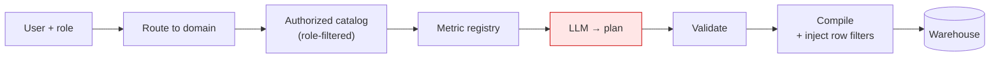

# Secure Query / LQP — Feature Plan (team discussion)

**Status:** Chinook + DuckDB, end to end.

**Goal:** Talk-to-data where the **LLM never writes SQL** — only `LogicalPlan` JSON → `validate(catalog)` → AST `compile` → execute.

**Current repo:** Trust kernel (IR, catalog, validate, compile), LLM planner, hardened
execute, and an accuracy harness that measures whether answers are actually right.

---

## Data

[Chinook](https://github.com/lerocha/chinook-database) (SQLite download → DuckDB),
with a synthetic same-schema fallback when offline. The catalog exposes all 11
tables — `Album`, `Artist`, `Customer`, `Employee`, `Genre`, `Invoice`,
`InvoiceLine`, `MediaType`, `Playlist`, `PlaylistTrack`, `Track` — with join keys
mirroring the source foreign keys, and PII flags on the contact, address and
birth-date columns that the real Chinook schema carries.

```
# Local loop
python -m secure_query.examples.load_sample_db   # download Chinook or synthetic fallback
python -m secure_query.examples.demo_catalog     # validate + compile
python -m secure_query.examples.run_sample_query # compile + DuckDB execute
```

---

## North star flow

```
user question
  → LLM emits LogicalPlan JSON only (structured output)
  → validate(plan, approved Catalog)
  → compile(plan) via sqlglot AST
  → execute: read-only, timeout, row limit
  → audit: question + plan JSON + sql + plan_hash + sql_hash
```

Hard rules:
- No SQL in model output or “fix with SQL” prompts
- Catalog is eng/business-approved, never LLM-authored as sole authority
- Empty `join_keys` = dev-only; production must allowlist joins

---

## Phase overview

| Phase | Outcome | Status |
|-------|---------|--------|
| **0** Land kernel | IR + validate + AST compile + tests | Done |
| **1** Catalog + local DB | Chinook allowlist + DuckDB load/execute | **Done** (all 11 tables) |
| **2** LLM planner | Model emits plans only; one repair then clarify | **Done** (`planner.py` + `ask_sample`) |
| **3** Execute + policy | Read-only, timeout, row cap, audit | **Done** (`execute.py`) |
| **4** Accuracy loop | Goldens, execution accuracy, guards, explain-back | **Done** |
| **5** Catalog breadth | 11 tables; multi-hop joins, table selection | **Done — 94% / 0% wrong** |
| **6** Retrieval + semantics | Table retrieval, synonyms, metric registry | Next — see below |
| **Scale** | Company-wide: authorization, metrics, domain routing | Not started — [see below](#scale--running-this-against-the-whole-company-database) |

---

## Phase 0 — Trust kernel (done)

- [x] Frozen Pydantic `LogicalPlan` IR
- [x] `Catalog` / `TableSpec` / `ColumnSpec` / `JoinKey`
- [x] `validate` + `validate_and_compile`
- [x] sqlglot AST compiler (default dialect DuckDB)
- [x] Unit tests

---

## Phase 1 — Catalog + local DB (done)

- [x] `sample_catalog.py` — all 11 Chinook tables + 10 approved joins from the source FKs
- [x] `demo_catalog.py` — points at the active catalog
- [x] `load_sample_db.py` — download or synthetic → `data/chinook.duckdb`
- [x] `run_sample_query.py` — validate → compile → DuckDB execute

---

## Phase 2 — LLM planner (plans only)

Build against **sample** `planner_summary()` first.

- [x] Prompt = catalog summary (+ joins), never raw rows (`secure_query/planner.py`)
- [x] Structured JSON → `LogicalPlan` (parse + local `plan_id`)
- [x] On `PlanValidationFailed`: one repair; then clarify
- [x] Never ask for / paste SQL (system + repair prompts)
- [x] Local demo: `python -m secure_query.examples.ask_sample "..."` (OpenAI or mock)
- [ ] Broader eval questions about Chinook (Phase 4)

---

## Phase 3 — Execute + policy

- [x] Thin execute path on DuckDB (`run_sample_query.py`)
- [x] Harden: `secure_query/execute.py` — timeout, row cap, JSONL audit stub
- [x] Timeout actually bounds wall clock (interrupts the query; never waits it out)
- [x] Column-level PII policy: high-PII blocked in filters/group-by/order-by/min/max,
      and list intents compile an explicit non-PII projection instead of `SELECT *`
- [x] Wired into `ask_sample` / `run_sample_query` → `data/audit.jsonl`

**Open**
- [x] Tenant isolation: principal catalog slice + compile-time row filters (`auth.py`); identity is server-side
- [ ] Policy: may a summarizer LLM see result cells? (default: no — see `docs/adr/001-result-policy.md`)

---

## Phase 4 — Extreme accuracy

Validation proves a query is *safe*, never that it is *right*. These are the
controls for correctness, plus the number they currently produce.

- [x] Golden tests on sample catalog: `plan.json` → `expected.sql` (`secure_query/evals/chinook/`)
- [x] Eval set: NL questions + structural checks; runner `python -m secure_query.evals.run_chinook`
- [x] **Execution accuracy**: 32 NL questions with hand-written reference SQL
      (`evals/chinook_live.json`); the planner's rows are compared to ground truth
- [x] **Plan explain-back** (`secure_query/explain.py`): every answer ships with a
      deterministic English description, including the grain each aggregate uses
- [x] **First-class refusal**: the planner may return `{"cannot_answer": true, ...}`
      so it can decline instead of substituting a similar query
- [x] Aliases may not impersonate restricted columns (`policy.misleading_alias`)
- [ ] Approved metrics registry — the remaining structural gap (see below)
- [ ] Clarify UX when linking is ambiguous (product)

- [x] **Deterministic question guards** (`secure_query/guard.py`), which run without
      the model: refuse up front when the question names a high-PII column, and
      refuse after planning when the plan ignores a column the question named

### Measured baseline (qwen2.5:7b via Ollama)

| metric | start | + refusal contract | + guards | **11-table catalog** |
| --- | --- | --- | --- | --- |
| catalog size | 2 tables | 2 | 2 | **11 tables, 88 columns** |
| suite size | 25 | 25 | 25 | **32 questions** |
| accuracy | 76% | 88% | 96% | **94%** |
| wrong answers (confident + incorrect) | 20% | 8% | 4% | **0%** |
| PII reaching the caller | 0 | 0 | 0 | **0** |

Zero wrong answers is the number that matters: every question the planner got
wrong, it declined instead. Accuracy is one point of coverage lower than the
narrow catalog, which is far less erosion than expected.

Note the confidence interval: at n=32, 94% is `[80%, 98%]`. The suite needs
~100 questions before it can distinguish good from great, and the questions
should come from real user logs rather than being invented.

**Honest caveat:** the system prompt and guards were tuned after seeing failures
on these same questions, so this number is partly fitted. Split the suite into a
dev set and a release-only holdout before trusting it.

**The one stable failure** is `top_genre`: asked which music genre earns most,
the planner returns revenue by billing country instead — 3/3 runs. The
dropped-concept guard cannot catch it, because "genre" matches nothing in the
catalog at all, and refusing on every unmatched word would also refuse
"revenue" (a legitimate synonym for `Invoice.Total`). Fixing this properly
needs catalog synonyms: declare that "revenue"/"spend"/"sales" mean
`Invoice.Total`, after which any remaining unmatched domain noun is genuinely
out of scope and can be refused deterministically.

**Known gap driving the rest:** the IR has no division, so ratios ("revenue per
customer", "growth rate", "share of total") cannot be expressed. The planner now
refuses them rather than returning `AVG(Total)`, which is a *different* number
(5.65 per invoice vs 39.47 per customer). An approved metrics registry —
named, catalog-owned definitions the planner selects rather than derives — is
the way to answer these correctly instead of declining.

```bash
pytest secure_query/tests/test_chinook_evals.py -q
python -m secure_query.evals.run_chinook

# execution accuracy against ground truth (this is the number that matters)
SECURE_QUERY_MODEL=qwen2.5:7b python -m secure_query.evals.run_chinook \
    --accuracy --provider ollama

# planner stability: ask each question 3x, report agreement
... --accuracy --provider ollama --repeat 3
# just one slice
... --accuracy --provider ollama --only pii
```

---

## Security checklist (product gate)

- [ ] LLM never outputs SQL strings
- [ ] Every plan passes `validate(plan, catalog)` before compile
- [ ] Compile is AST-only (no f-string SQL)
- [ ] Execute: read-only, timeout, limit
- [ ] Tenant isolation enforced at compile/execute
- [x] Audit: question, plan JSON, plain-English explanation, sql, hashes
      (`execute.py` → `data/audit.jsonl` locally)
- [ ] Approved catalog only (not full discovered dump)
- [ ] Human confirms the explain-back before results are trusted for a decision

---

## Phase 5 — Catalog breadth (done)

The catalog now carries Chinook's full 11 tables and 88 columns with join keys
taken from the source foreign keys. What the widening actually taught us:

- **Multi-hop joins work.** `InvoiceLine → Track → Genre` planned correctly on
  the first try, so the flat join list and pairwise `join_keys` are not the
  bottleneck they looked like.
- **Table selection was not the dominant error mode.** Questions that needed
  Employee, Track or MediaType picked the right table every time.
- **Prompt scale is not yet a problem.** `planner_summary()` is 88 lines /
  2.8 KB at 11 tables. Retrieval becomes necessary somewhere past ~50 tables.
- **The real failure mode is the grouping key.** Both failures joined a lookup
  table and then forgot to group by its label, returning a grand total or raw
  ids where a per-group breakdown was asked for.

Three fixes came out of it, all of which turn a wrong answer into a refusal:

- `guard.useless_joins` — a joined table that no filter, grouping, aggregate or
  ordering reads cannot change the result, so the planner meant to use it and
  forgot. Bridge tables on the path to a table that *is* read stay legal.
- `policy.ungrouped_label_aggregate` — `MAX(Genre.Name)` beside `SUM(Quantity)`
  returns the alphabetically last genre next to a grand total, which reads like
  a per-genre answer and is not one.
- `restricted_request` now refuses only when *every* column a word could mean is
  high-PII. Marking `BillingAddress` restricted otherwise made the word "billing"
  refuse every billing-country question — a false positive that only appears
  once the catalog is wide enough to contain both meanings.

Also worth recording: two eval cases had no ground truth as written. "How many
tracks per media type" is ambiguous between the id and the name, and both are
defensible, so the questions were rewritten to say which. Ambiguity is not a
model failure and should not be scored as one.

---

## Phase 6 — Retrieval and semantics (next)

- **Per-question table retrieval**, needed before the catalog reaches ~50 tables.
- **Label preference** — teach the planner to group by `Genre.Name` rather than
  `Track.GenreId`. Prompt wording alone failed: it made the model aggregate the
  label instead of grouping by it, and regressed a passing case. This likely
  needs an IR affordance (declare a lookup's display column in the catalog and
  resolve ids to labels at compile time) rather than more prompting.
- **Ratios and derived metrics** — `revenue_growth_rate` and per-unit revenue
  (`UnitPrice * Quantity`) are still inexpressible, so the planner correctly
  declines. A metric registry would turn these into first-class named measures.
- **Holdout suite** from real user logs, kept out of the tuning loop.

---

## Scale — running this against the whole company database

Everything above is validated on one curated 11-table catalog with a single
implicit user. Pointing this at the company warehouse changes the problem, and
these are the things that have to be true first. Ordered by what blocks you,
not by difficulty.



### 1. Per-user authorization (blocker)

Today there is a principal-scoped catalog and compile-time `row_filters`, but
`catalog.tenant_id` is not auto-injected as a SQL predicate — you must put the
row constraint on the principal (or rely on Unity Catalog RLS). Company
wide, finance sees finance and HR sees HR, and a regional manager sees only their
region. The catalog has to become a **function of the requester**, not a file:

- Resolve allowed tables and columns per role at request time.
- Inject mandatory row predicates at compile time, where the plan cannot drop them.
- Record the principal in the audit record.

Nothing else on this list matters if one login can read payroll.

### 2. Metric registry (highest leverage)

Instead of the model choosing between three columns that might mean revenue, it
chooses a **named approved metric that owns its definition**. This fixes three
problems with one artifact:

- **Semantic ambiguity** — one blessed definition per business concept.
- **The ratio gap** — a ratio becomes a registry measure, not an IR feature, so
  `revenue_growth_rate` stops being a refusal without widening the IR.
- **Prompt size** — fifty metrics compress a thousand columns.

It converts unbounded IR expansion into governed content analysts can own without
touching code. Build this before adding IR features.

### 3. Domain partitioning, then retrieval

Do not build one catalog for the company. Build per-domain catalogs, route the
question to a domain first, retrieve within it. Ambiguity stays local, prompts
stay small, and each domain goes live independently.

Retrieval stays a **performance optimization, never a security control** —
validation still runs against the full authorized catalog, so a bad retrieval
produces a refusal, never a leak.

### 4. Catalog as a pipeline, not a file

Curation cannot be automated away — it is the security boundary — but the toil
around it can:

- Auto-generate drafts from `information_schema`.
- Data owner approves by PR; goldens run in CI on every catalog change.
- Alert on upstream schema drift rather than discovering it via a failed query.

### 5. Per-domain eval sets with a holdout

Each domain ships with its own ground truth mined from real query logs, and its
own accuracy number. No domain goes live without one. This is the gate that keeps
the wrong-answer rate at zero while coverage expands.

### 6. Decide what the IR will never do

Pick the boundary deliberately and route everything past it to a human analyst.
An explicit "an analyst will pick this up" hand-off is a better product than
slowly weakening the guarantee until it is just an LLM writing SQL again.

### The uncomfortable half

Roughly half of this is org design, not engineering: who owns each domain catalog,
who approves a metric definition, what the SLA is when a schema changes. The
technical pieces are tractable. Projects like this fail on the ownership question.
Get names against domains before writing much more code.

**Sequencing:** authorization → metric registry → domain routing. Roll out one
domain at a time, each gated on its own accuracy numbers. No big bang.

---

## Discussion agenda (for team meeting)

1. How wide should the catalog get, and who approves each table?
2. Planner hosting / model vendor (all numbers below are a local 7B).
3. PII / summarizer policy.
4. Success metrics: wrong-answer rate as a release gate vs raw accuracy.
5. **Scale (see section below):** who owns each domain catalog and who approves a
   metric definition? Build vs buy against Databricks Genie, given the data
   already lives there.

---

## References

- Active catalog: `secure_query/examples/sample_catalog.py`
- Load / run: `load_sample_db.py`, `run_sample_query.py`
- Kernel: `secure_query/` (`logical_plan`, `catalog`, `validate`, `compile`)
- Chinook source: https://github.com/lerocha/chinook-database
