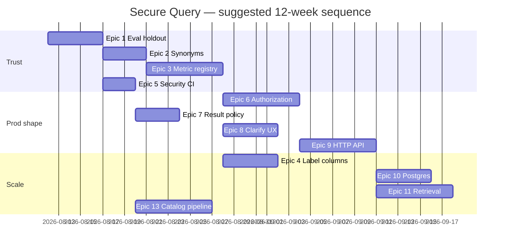

# Secure Query — Master Roadmap (all unfinished work)

**Repo:** `/Users/samjordan/Desktop/secure-query`  
**Last updated:** 2026-08-11  
**North star:** LLM emits `LogicalPlan` only → validate(catalog) → AST compile → execute → audit. **Wrong answer rate = 0** is the release gate, not raw accuracy.

This document consolidates every open item from `PLAN.md`, the security checklist, and scale work into one sequenced backlog.

**→ Action checklist:** [WORK_CHECKLIST.md](WORK_CHECKLIST.md) — tick boxes as you implement.

---

## How to read this

| Symbol | Meaning |
|--------|---------|
| **P0** | Blocks production or trust claims |
| **P1** | High leverage; do before scale |
| **P2** | Important; can ship a domain without it |
| **P3** | Platform / org work |

Each epic has: **goal**, **tasks**, **acceptance criteria**, **depends on**, **estimate**.

---

## Current state (done)

- [x] Phase 0: IR, catalog model, validate, sqlglot compile, unit tests
- [x] Phase 1: Full Chinook catalog (11 tables), DuckDB load/execute demo
- [x] Phase 2: LLM planner (Ollama/Groq/OpenAI), repair loop, no SQL in output
- [x] Phase 3: Execute (timeout, row cap, read-only, JSONL audit)
- [x] Phase 4/5: Guards, explain-back, golden evals, execution accuracy harness
- [x] PII policy, explicit list projection, misleading-alias block
- [x] Authorization: principal catalog slice, metric allowlist, row filters, server-side identity
- [x] Databricks execute + Unity Catalog catalog draft (`databricks.py`)

---

## Release gates (define “done” per milestone)

### Milestone A — **Trustworthy demo** (Chinook, single user)
- [ ] Holdout eval: **0 wrong answers** on holdout set (n ≥ 12)
- [ ] Dev eval suite: n ≥ 100 questions
- [ ] Security checklist items 1–4 verified in CI
- [ ] Synonyms + metric registry v0 shipped

### Milestone B — **First production domain**
- [x] Authorization: role-filtered catalog + compile-time row predicates
- [x] HTTP API + audit with principal id
- [ ] Per-domain eval + holdout before go-live
- [x] Summarizer policy documented and enforced

### Milestone C — **Company scale**
- [ ] Domain routing + table retrieval
- [ ] Catalog pipeline (draft → PR → CI goldens)
- [ ] Second warehouse dialect (Postgres or Snowflake)
- [ ] Org ownership model signed off

---

## Epic 1 — Eval discipline (P0)

**Goal:** Stop tuning on the same questions you measure. Make eval numbers trustworthy.

| ID | Task | Estimate |
|----|------|----------|
| 1.1 | Split `chinook_live.json` → `evals/dev.json` + `evals/holdout.json` (e.g. 70/30) | 0.5d |
| 1.2 | Update `run_chinook.py`: `--split dev|holdout|all`; fail CI if holdout wrong-rate > 0 | 1d |
| 1.3 | Expand dev suite to **100+ questions** (real phrasing, tagged by intent/table/PII) | 2d |
| 1.4 | Add `--repeat N` stability report to CI (plan agreement rate) | 0.5d |
| 1.5 | Document eval protocol in `docs/EVAL.md` (no holdout tuning rule) | 0.5d |

**Acceptance**
- Holdout never referenced in prompt/guard tuning commits
- CI runs: `pytest` + `run_chinook --split holdout --accuracy` on main
- README reports dev vs holdout metrics separately

**Depends on:** nothing

---

## Epic 2 — Catalog synonyms (P0)

**Goal:** Fix semantic linking (`revenue` → `Invoice.Total`, `genre` → `Genre.Name`) without widening IR.

| ID | Task | Estimate |
|----|------|----------|
| 2.1 | Add `Synonym(term, table_id, column_id)` to `catalog.py` | 0.5d |
| 2.2 | Include synonyms in `planner_summary()` | 0.5d |
| 2.3 | Extend `guard.dropped_concepts`: unmatched domain nouns → refuse (after synonym match) | 1d |
| 2.4 | Populate Chinook synonyms in `sample_catalog.py` (~20 terms) | 0.5d |
| 2.5 | Tests + eval cases for `top_genre`, revenue synonyms | 1d |

**Acceptance**
- `top_genre` either answers correctly or refuses (never billing-country substitute)
- Synonym resolution is catalog-owned, not prompt-owned

**Depends on:** Epic 1 (holdout to verify fix)

---

## Epic 3 — Metric registry v0 (P0)

**Goal:** Named approved metrics; planner picks metric id instead of inventing aggs. Unblocks ratios without IR division.

| ID | Task | Estimate |
|----|------|----------|
| 3.1 | New `metrics.py`: `MetricSpec(id, description, plan_template or expansion fn)` | 1d |
| 3.2 | Attach `metrics: list[MetricSpec]` to `Catalog` | 0.5d |
| 3.3 | Planner prompt: prefer metric id when question matches; expand to `LogicalPlan` server-side | 2d |
| 3.4 | Validator: plans referencing metrics must expand to valid catalog refs | 1d |
| 3.5 | Seed ~10 Chinook metrics: `total_revenue`, `invoice_count`, `avg_revenue_per_customer`, `revenue_by_country`, … | 1d |
| 3.6 | Golden + accuracy evals for ratio/per-unit questions | 1d |

**Acceptance**
- “Average revenue per customer” uses blessed definition, not `AVG(Total)`
- Metric definitions are human-approved YAML/Python, versioned in repo
- Planner JSON may include `"metric_id": "..."` OR full plan (both paths tested)

**Depends on:** Epic 2 (synonyms overlap)

---

## Epic 4 — Label / lookup columns (P1)

**Goal:** Group by `Genre.Name` not `Track.GenreId` without prompt hacks.

| ID | Task | Estimate |
|----|------|----------|
| 4.1 | Add `display_column` on `TableSpec` or `ColumnSpec` for FK → label resolution | 0.5d |
| 4.2 | Catalog: `Genre` display = `Name`, `Track.GenreId` → join Genre for labels | 0.5d |
| 4.3 | Optional compile-time rewrite OR planner hint in summary (“group by Genre.Name for genre questions”) | 2d |
| 4.4 | Eval: “tracks per genre name”, “top genre by revenue” | 1d |

**Acceptance**
- No `ungrouped_label_aggregate` false positives for valid genre breakdowns
- Id vs name ambiguity documented; clarify UX for dual-valid questions

**Depends on:** Epic 2, 3

---

## Epic 5 — Security checklist closure (P0)

**Goal:** Turn implemented controls into verified, documented gates.

| ID | Task | Status in code | Work remaining |
|----|------|----------------|----------------|
| 5.1 | LLM never outputs SQL | ✅ parse check + tests | Add CI grep: no `SELECT` in planner tests; mark done |
| 5.2 | Every plan passes validate before compile | ✅ | Enforce: no public `compile()` without validate in API docs |
| 5.3 | AST-only compile | ✅ | CI grep: no f-strings in `compile.py` |
| 5.4 | Execute: RO, timeout, limit | ✅ | Integration test proving timeout interrupts |
| 5.5 | Tenant isolation | ❌ | Epic 6 |
| 5.6 | Audit trail | ✅ local JSONL | Add principal field (Epic 6) |
| 5.7 | Approved catalog only | ⚠️ | Epic 9 pipeline |
| 5.8 | Human confirm explain-back | ❌ | Epic 10 |

| ID | Task | Estimate |
|----|------|----------|
| 5.9 | `docs/SECURITY.md`: threat model + checklist with evidence links | 1d |
| 5.10 | GitHub Action: pytest + holdout accuracy + grep gates | 1d |

**Acceptance**
- README checklist matches reality (checked items only when CI proves them)

**Depends on:** Epic 1, 6 (for tenant)

---

## Epic 6 — Authorization & tenant isolation (P0 for prod)

**Goal:** Catalog and rows are a function of the authenticated user.

| ID | Task | Estimate |
|----|------|----------|
| 6.1 | `Principal` model: `tenant_id`, `roles`, optional `row_predicates` | 0.5d | **done** |
| 6.2 | `Catalog.for_principal(principal) -> Catalog` filters tables/columns | 1d | **done** |
| 6.3 | Inject mandatory `filters` from principal (non-droppable) | 2d | **done** |
| 6.4 | Validator: reject plans that touch tables/columns not in authorized catalog | 1d | **done** |
| 6.5 | Audit: record `principal_id`, `tenant_id` | 0.5d | **done** |
| 6.6 | Tests: two tenants, cross-read attempt → rejected | 1d | **done** |

**Acceptance**
- User A cannot query tables only in User B's catalog slice
- Injected tenant predicate survives compile; not in LLM plan JSON
- Document in `SECURITY.md`

**Depends on:** Epic 5  
**Blocks:** Milestone B

---

## Epic 7 — Summarizer / result policy (P1)

**Goal:** Decide and enforce what happens to query result cells.

| ID | Task | Estimate |
|----|------|----------|
| 7.1 | ADR: `docs/adr/001-result-policy.md` — options: no LLM on cells / aggregates only / full | 0.5d |
| 7.2 | Implement default: **template answer from explain + table** (no LLM) | 1d |
| 7.3 | Optional `summarize.py`: LLM sees capped aggregate rows only; block if PII column in result | 2d |
| 7.4 | Audit: log whether summarizer ran and row count seen | 0.5d |

**Acceptance**
- Policy is explicit; default path requires no extra LLM call
- PII columns never passed to summarizer

**Depends on:** Epic 5

---

## Epic 8 — Product UX: clarify & confirm (P1)

**Goal:** Handle ambiguity and human trust.

| ID | Task | Estimate |
|----|------|----------|
| 8.1 | `PlannerResult` already has `clarify` — wire structured clarify reasons to UI contract | 1d |
| 8.2 | Ambiguity detector: question matches multiple metrics/tables → clarify | 2d |
| 8.3 | **Confirm gate**: return `explain_plan()` + “Run query?” before execute (API flag) | 1d |
| 8.4 | `ask_sample.py --confirm` demo | 0.5d |

**Acceptance**
- Ambiguous questions never silently pick a default
- High-stakes mode requires confirm before execute

**Depends on:** Epic 3, 4

---

## Epic 9 — HTTP API & deployment shell (P1)

**Goal:** Runnable service, not just CLI demos.

| ID | Task | Estimate |
|----|------|----------|
| 9.1 | FastAPI app: `POST /ask`, `POST /ask/confirm`, `GET /health` | 2d |
| 9.2 | Request carries auth token → `Principal` | 1d |
| 9.3 | Config: catalog path, db path, model provider env | 0.5d |
| 9.4 | Docker Compose: API + DuckDB volume (Chinook demo) | 1d |
| 9.5 | OpenAPI docs + example curl | 0.5d |

**Acceptance**
- One curl question → explain → SQL → results → audit line
- No SQL accepted from client body

**Depends on:** Epic 6, 7, 8 (minimal API can ship without 8 confirm)

---

## Epic 10 — Second dialect & warehouse (P2)

**Goal:** Not DuckDB-only for production.

| ID | Task | Estimate |
|----|------|----------|
| 10.1 | `compile(dialect=...)` already exists — add Postgres golden tests | 1d |
| 10.2 | `execute_postgres()` with same policy knobs as DuckDB | 2d |
| 10.3 | Dialect-specific tests (DATE_TRUNC, identifiers) | 1d |
| 10.4 | Document dialect switch in README | 0.5d |

**Acceptance**
- Same LogicalPlan compiles to valid Postgres for Chinook subset
- Execute path parity (timeout, row cap, audit)

**Depends on:** Epic 5

---

## Epic 11 — Table retrieval (P2, before ~50 tables)

**Goal:** Shrink planner prompt when catalog grows.

| ID | Task | Estimate |
|----|------|----------|
| 11.1 | Embed table/column descriptions (local sentence-transformers or API) | 2d |
| 11.2 | `retrieve_tables(question, catalog, k=5) -> Catalog slice` | 2d |
| 11.3 | **Critical:** validate full authorized catalog, not retrieval slice | 1d |
| 11.4 | Eval: retrieval recall on dev suite | 1d |

**Acceptance**
- Retrieval miss → refusal, never leak
- Prompt size bounded as table count grows

**Depends on:** Epic 1, 6

---

## Epic 12 — Domain routing (P2, scale)

**Goal:** Multiple domain catalogs (finance, HR, …).

| ID | Task | Estimate |
|----|------|----------|
| 12.1 | `Domain` registry: id, catalog path, eval suite path | 1d |
| 12.2 | Router: question → domain id (rules or small classifier) | 2d |
| 12.3 | Per-domain go-live checklist | 0.5d |
| 12.4 | API: `domain` param or auto-route | 1d |

**Acceptance**
- Each domain has isolated catalog + eval holdout
- Cross-domain table access impossible

**Depends on:** Epic 6, 9, 11

---

## Epic 13 — Catalog pipeline (P2)

**Goal:** Catalog is curated but maintainable.

| ID | Task | Estimate |
|----|------|----------|
| 13.1 | `scripts/draft_catalog.py` from DuckDB/Postgres `information_schema` | 2d |
| 13.2 | Output diff-friendly YAML for PR review | 1d |
| 13.3 | CI: catalog change → run goldens + holdout | 1d |
| 13.4 | Schema drift detector (scheduled job) | 2d |

**Acceptance**
- New column in DB does not appear in queries until catalog PR merged
- Drift alerts data owner

**Depends on:** Epic 1, 5

---

## Epic 14 — IR boundary decision (P3)

**Goal:** Explicitly document what the IR will **never** do.

| ID | Task | Estimate |
|----|------|----------|
| 14.1 | ADR: no arbitrary expressions, no subqueries, no windows (v1) | 0.5d |
| 14.2 | “Analyst handoff” API when question exceeds IR | 1d |
| 14.3 | Resist pressure to add division/CTE until metric registry exhausted | ongoing |

**Acceptance**
- Team agrees: ratios → metrics; complex SQL → human analyst
- No scope creep into “LLM writes SQL for edge cases”

**Depends on:** Epic 3

---

## Epic 15 — Hardening & red team (P2)

**Goal:** Prove security claims beyond happy path.

| ID | Task | Estimate |
|----|------|----------|
| 15.1 | 50+ adversarial planner prompts (injection in question, SQL in JSON) | 2d |
| 15.2 | Hypothesis fuzz: random valid plans → compile → DuckDB parse | 2d |
| 15.3 | Property: injected tenant filter always present in compiled SQL | 1d |
| 15.4 | Document results in `docs/SECURITY.md` | 0.5d |

**Acceptance**
- No adversarial case produces unvalidated SQL execution
- Fuzz 10k plans without compiler crash

**Depends on:** Epic 5, 6

---

## Epic 16 — Org & ownership (P0 for scale, non-code)

**Goal:** Assign humans before building company-wide.

| ID | Task | Owner |
|----|------|-------|
| 16.1 | Name catalog owner per domain | TBD |
| 16.2 | Metric definition approval process | TBD |
| 16.3 | Schema change SLA | TBD |
| 16.4 | Build vs buy decision (Databricks Genie, etc.) | TBD |
| 16.5 | Wrong-answer rate = 0 as release policy (signed) | TBD |

**Acceptance**
- RACI doc in `docs/OWNERSHIP.md`
- No production domain without named owner

---

## Recommended sequence



### Sprint-sized order (if solo)

1. **Week 1–2:** Epic 1 + 2 + 5 (trustworthy eval + synonyms + CI)
2. **Week 3–4:** Epic 3 + 4 (metrics + labels)
3. **Week 5–6:** Epic 6 + 7 (auth + result policy)
4. **Week 7–8:** Epic 8 + 9 (UX + API) → **Milestone B**
5. **Week 9–12:** Epic 10–13, 15 as needed for first real domain
6. **Parallel always:** Epic 16 (org)

---

## Out of scope (explicitly defer)

- LLM-generated catalog as sole authority
- Widening IR (division, CTEs, windows) before metric registry
- Multi-agent orchestration (critic, router beyond domain)
- Real-time streaming / mutations / write paths
- Cross-tenant semantic memory (taf-talk DATA-TALK 2.0 idea)

---

## Quick reference: open items from PLAN.md

| Open item | Epic |
|-----------|------|
| Broader eval questions | 1 |
| Tenant isolation | 6 |
| Summarizer policy | 7 |
| Metric registry | 3 |
| Clarify UX | 8 |
| Holdout suite | 1 |
| Synonyms / top_genre | 2 |
| Label preference (Genre.Name) | 4 |
| Table retrieval | 11 |
| Domain routing | 12 |
| Catalog pipeline | 13 |
| Authorization at scale | 6, 12 |
| Human confirm explain-back | 8 |
| Security checklist unchecked | 5 |

---

## Next action (start here)

```bash
cd /Users/samjordan/Desktop/secure-query

# 1. Split eval suite
#    → evals/dev.json + evals/holdout.json

# 2. Add synonyms to sample_catalog.py

# 3. CI workflow: pytest + holdout --accuracy
```

When Epic 1–3 are done, re-run:

```bash
SECURE_QUERY_MODEL=qwen2.5:7b python -m secure_query.evals.run_chinook \
  --accuracy --provider ollama --split holdout
```

Target: **0 wrong on holdout**, accuracy as high as possible without sacrificing that.
